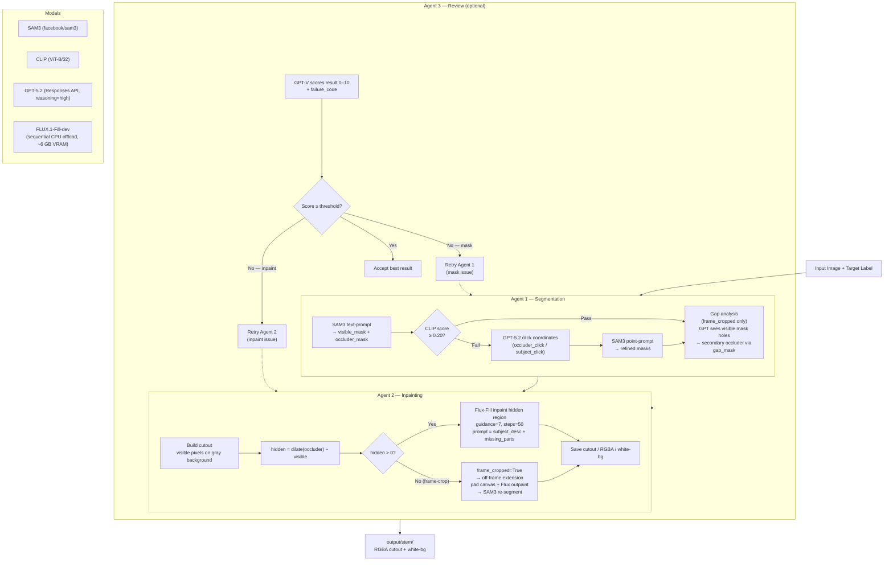

# Amodal Completion Pipeline

```mermaid
flowchart TD
    IMG["Input Image + Target Label"]

    subgraph A1 ["Agent 1 — Segmentation"]
        S1["SAM3 text-prompt\n→ visible_mask + occluder_mask"]
        S2{"CLIP score\n≥ 0.20?"}
        S3["GPT-5.2 click coordinates\n(occluder_click / subject_click)"]
        S4["SAM3 point-prompt\n→ refined masks"]
        S5["Gap analysis\n(frame_cropped only)\nGPT sees visible mask holes\n→ secondary occluder via gap_mask"]

        S1 --> S2
        S2 -- "Pass" --> S5
        S2 -- "Fail" --> S3 --> S4 --> S5
    end

    subgraph A2 ["Agent 2 — Inpainting"]
        I1["Build cutout\nvisible pixels on gray background"]
        I2["hidden = dilate(occluder) − visible"]
        I3{"hidden > 0?"}
        I4["Flux-Fill inpaint hidden region\nguidance=7, steps=50\nprompt = subject_desc + missing_parts"]
        I5["frame_cropped=True\n→ off-frame extension\npad canvas + Flux outpaint\n→ SAM3 re-segment"]
        I6["Save cutout / RGBA / white-bg"]

        I1 --> I2 --> I3
        I3 -- "Yes" --> I4 --> I6
        I3 -- "No (frame-crop)" --> I5 --> I6
    end

    subgraph A3 ["Agent 3 — Review (optional)"]
        R1["GPT-V scores result 0–10\n+ failure_code"]
        R2{"Score ≥ threshold?"}
        R3["Retry Agent 1\n(mask issue)"]
        R4["Retry Agent 2\n(inpaint issue)"]
        R5["Accept best result"]

        R1 --> R2
        R2 -- "No — mask" --> R3 -.-> A1
        R2 -- "No — inpaint" --> R4 -.-> A2
        R2 -- "Yes" --> R5
    end

    IMG --> A1
    A1 --> A2
    A2 --> A3
    A3 --> OUT["output/stem/\nRGBA cutout + white-bg"]

    subgraph MODELS ["Models"]
        M1["SAM3 (facebook/sam3)"]
        M2["CLIP (ViT-B/32)"]
        M3["GPT-5.2 (Responses API, reasoning=high)"]
        M4["FLUX.1-Fill-dev\n(sequential CPU offload, ~6 GB VRAM)"]
    end
```
